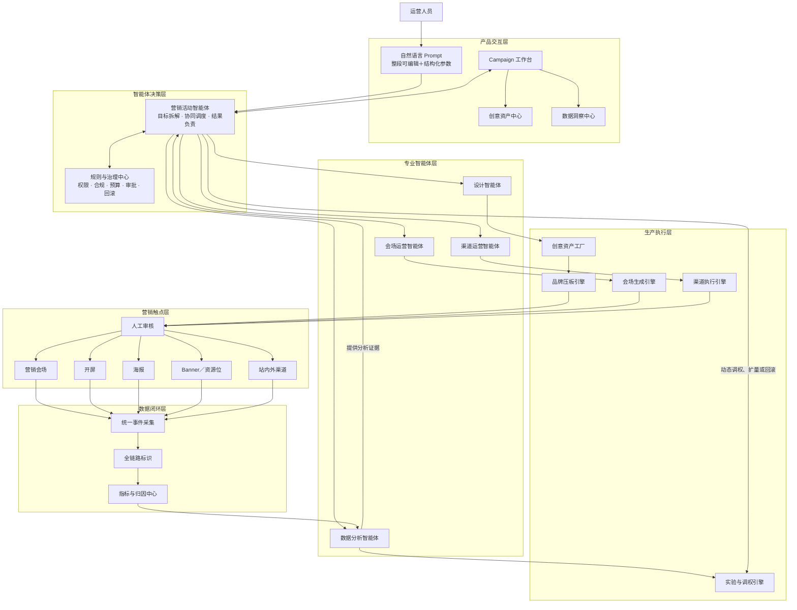

# 京营造｜AI Native 全域营销自动化平台

> 从一句运营目标出发，自动完成创意生产、会场搭建、渠道分发、数据回收和动态优化。

「京营造」是一款面向电商营销运营场景的 AI Native 全链路自动化平台。平台以 **营销活动智能体** 为总控，协同设计、会场运营、渠道运营、数据分析和治理等专业智能体，将传统依赖多人串行协作的“策划—设计—搭建—投放—分析”流程，升级为可协作、可追溯、可审核、可持续优化的智能营销闭环。

## 项目背景

传统营销活动通常需要运营、设计、研发和数据团队跨角色协作。开屏、海报、Banner、资源位与会场分别生产，存在以下问题：

- 内容生产周期长，重复沟通和多尺寸适配工作量大。
- 品牌压板、搜索框、权益和安全区依赖人工检查，规范难统一。
- 创意、资源位、会场和订单数据相互割裂，难以完成全链路归因。
- 上线后的优化依赖人工经验，缺少可靠的实验、扩量、停流和回滚机制。
- 现有 AI 工具多停留在单点生成阶段，没有真正对营销结果负责。

## 项目目标

建设一个覆盖日常运营和大促活动的全域营销平台，打通：

```text
运营目标 → 创意生产 → 会场搭建 → 审核发布 → 渠道分发
        → 数据回收 → AI 分析 → 动态调权 → 扩量或回滚
```

平台在权限、预算、品牌规范、业务护栏和人工审批的约束下，逐步提升自动化与智能体自治水平。

## 核心能力

### 1. 整段可编辑 Prompt

运营可以直接改写完整提示词，也可以通过句内结构化槽位设置：

- 活动主题
- 主推品类
- 核心权益
- 京东大促品牌压板
- 京东搜索框压板
- 视觉风格
- 尺寸比例

页面所见的完整句子会直接生成结构化 `GenerationBrief`，避免自然语言与配置项不一致。

### 2. 多类型营销资产生产

当前支持以下任务类型：

- 开屏
- 营销海报
- Banner／资源位
- 营销会场

每次任务固定创建 4 个候选方案，支持独立状态、单图失败重试、方案选择、文案精修和版本递增。

### 3. 确定性品牌与合规保护

生成模型负责创意底图，品牌相关固定层由确定性规则处理：

- 京东大促品牌压板
- 京东搜索框
- CTA 与利益点
- 主体安全区和禁放区
- 尺寸、清晰度和文案长度

规则未通过的资产不能提交审核。

### 4. 会场自动搭建

会场通过 Page Schema、组件注册表和页面版本生成，支持：

- 权益首屏、优惠券和商品组件
- 组件级锁定和 AI 调整权限
- 多个 AI 编排候选方案
- 移动端与宽屏实时预览
- 规则复检和提交审核

### 5. 多智能体协同

营销活动智能体位于最高总控层，对活动目标和最终结果负责：

| 智能体 | 职责 |
| --- | --- |
| 营销活动智能体 | 理解目标、拆解任务、调度智能体、处理冲突、决定优化策略 |
| 设计智能体 | 生产 KV、开屏、海报、Banner 和多尺寸视觉资产 |
| 会场运营智能体 | 搭建会场、编排权益、调整组件权重和管理页面版本 |
| 渠道运营智能体 | 管理资源位、人群、排期、频控、发布、扩量与停流 |
| 数据分析智能体 | 实时监控、异常识别、全链路归因和实验判胜 |
| 治理智能体 | 校验权限、品牌、合规、预算和业务护栏 |

智能体只提交结构化动作意图，真实发布、停流和回滚由确定性执行系统完成。

## 产品架构



## 端到端演示链路

项目规划的完整可演示闭环为：

1. 运营编辑 Prompt 并创建 Campaign。
2. 系统生成 4 个候选资产，模拟单图失败和独立重试。
3. 运营选择方案、精修文案、完成规则检查并提交审核。
4. 审核通过后，资产进入 Campaign 资产库。
5. 营销活动智能体调度专业智能体完成会场、渠道和数据任务。
6. 运营批准投放，系统模拟开屏、Banner、资源位和会场发布。
7. 数据层回收曝光、点击、到达、加购、成交和 GMV。
8. 数据异常触发 AI 优化建议和小流量实验。
9. 实验胜出后扩量；触发护栏时自动停流并回滚稳定版本。

## 当前进度

已完成：

- [x] 快速生成与全链路活动双入口
- [x] 整段 Prompt 编辑与句内组合框
- [x] 4 个候选资产的独立状态与失败重试
- [x] 品牌压板、搜索框、安全区和文案规则检查
- [x] 文案精修、版本管理、审核和资产归档
- [x] Campaign 用户旅程与专业智能体任务界面
- [x] 会场 Schema、组件注册表、候选方案与实时预览
- [x] AI Native 多智能体产品架构与实施规格
- [x] 单元测试、类型检查和生产构建基线

下一阶段：

- [ ] 用统一 Campaign 状态机贯通现有页面
- [ ] 模拟渠道发布、部分失败和幂等重试
- [ ] 模拟实时指标流与数据质量状态
- [ ] 打通 AI 实验建议、批准、扩量和回滚
- [ ] 增加事件时间线、本地快照恢复和一键重置
- [ ] 逐步替换为真实生图、素材、商品、权益、渠道和数据接口

## 技术栈

- React
- TypeScript
- Vite
- Zod
- Vitest
- Lucide React
- CSS

## 本地运行

### 环境要求

- Node.js 20 或更高版本
- npm

### 安装与启动

```bash
npm install
npm run dev
```

启动后，根据终端提示访问本地地址，通常为：

```text
http://127.0.0.1:4173/
```

### 工程验证

```bash
npm test
npm run typecheck
npm run build
```

## 目录结构

```text
src/
├── components/          # Prompt、Campaign、会场和资产界面
│   └── venue/           # 会场业务组件与注册表
├── data/                # 演示候选和样例会场数据
├── domain/              # Brief、资产生产、Campaign 等领域模型
├── schema/              # Page Schema 与校验
├── App.tsx              # 主视图与页面流程
└── styles.css           # 全局产品视觉

docs/
└── superpowers/
    ├── specs/           # 产品与技术规格
    └── plans/           # 分阶段实施计划
```

## 设计原则

- **AI 负责决策，确定性系统负责执行。**
- **品牌压板和交易权益不交给模型自由生成。**
- **所有线上动作可解释、可审计、可暂停、可回滚。**
- **先完成低风险的人机协同，再逐步开放智能体自治。**
- **以 Campaign 到 Order 的统一标识连接全域营销数据。**

## 说明

当前仓库为产品原型与可演示闭环的开发版本，页面中的生成、投放和实时数据主要用于验证产品流程，不代表已经连接生产环境或产生真实业务收益。
