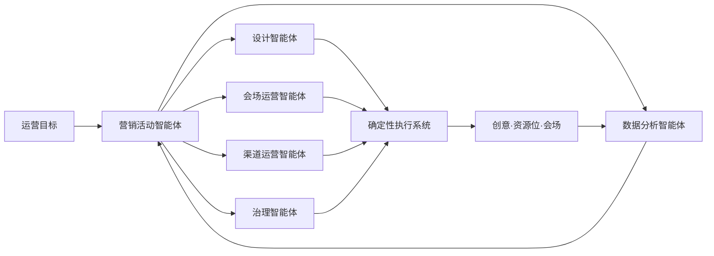

# AI Native 全域营销自动化平台项目介绍

## 1. 项目简介

本项目是面向京东营销场景的 AI Native 全域运营平台。运营通过自然语言及句内选项输入活动、权益、商品、京东大促品牌压板、搜索框压板、风格和尺寸，平台即可生成开屏、海报、Banner、站内资源位及营销会场，并完成审核投放、数据回收、实验调权和复盘。

## 2. 项目亮点｜核心痛点（300字以内）

传统营销活动需要运营、设计、研发和数据团队串行协作。开屏、海报、资源位与会场分别生产，重复沟通和尺寸适配工作量大；品牌压板、搜索框、权益及安全区依赖人工检查，容易产生合规风险。上线后各触点数据割裂，难以判断问题来自素材、资源位还是会场承接，也缺少可靠的实验、增量归因和回滚机制。

## 3. 关键创新点（300字以内）

1. 采用“营销活动智能体＋五个专业智能体”架构，对设计、会场、渠道、数据和治理分工调度。
2. 构建“快速生成＋全链路活动”双入口。
3. 品牌压板、搜索框、风格和尺寸等要求以句内选项嵌入自然语言 Prompt。
4. AI 生成创意底图，Logo、搜索框、CTA 和脚注由确定性引擎压板。
5. 通过跨触点组合实验与 L0–L3 分级自治，实现可解释、可审计、可回滚的自动优化。

## 4. 价值贡献（300字以内）

参考《产研价值驱动-项目收益指标库》，项目从效率、收入和质量三方面衡量价值。试点目标：单项任务 5 分钟内产出 4 张候选，多资源生产人工工时降低≥70%，模板及安全区校验通过率≥95%，投放资产可追溯率 100%。经营侧通过同期对照实验评估 GMV、毛利、有效单量、支付转化率及广告 ROI 增量；异常资源位可独立停流回滚。以上为建设期目标，不作为已实现收益。

## 5. 方案介绍（500字以内）

平台由营销活动智能体、设计/会场运营/渠道运营/数据分析/治理智能体、Prompt Composer、创意资产工厂、会场引擎、渠道执行中心和实时实验平台组成。

运营可快速生成单项资源，也可创建完整 Campaign。Prompt Composer 将京东大促品牌压板、搜索框、权益、商品、风格和尺寸做成自然语言中的可选槽位。设计智能体调用生图工具固定生成 4 张底图，程序再叠加 Logo、权益、搜索框、CTA 和脚注并执行规则校验。

营销活动智能体围绕“曝光—兴趣—到达—转化—再传播”调度专业智能体。所有资产共享统一 Campaign 标识，回收曝光、点击、会场到达、加购、支付、GMV 和毛利数据。系统以“创意＋资源位＋会场版本”组合开展小流量实验；智能体只提交动作意图，确定性系统负责发布、采集、停流和回滚。

